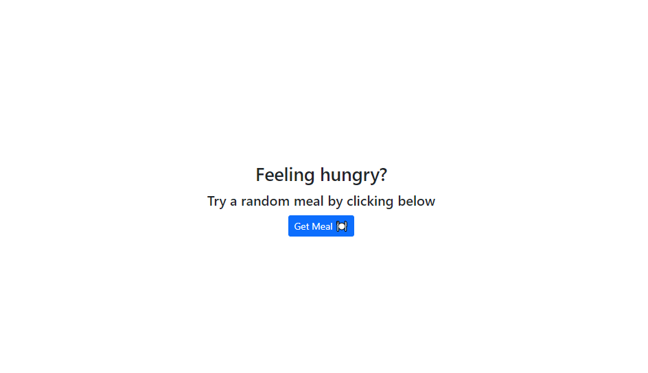
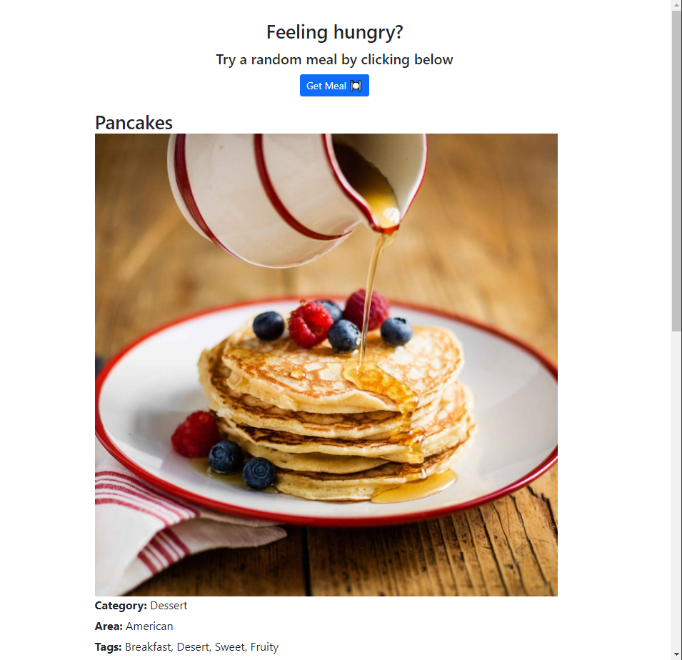

# Random-Meal

## Table of Contents
* [Description](#description)
* [Installation](#installation)
* [Usage](#usage)
* [Licenses](#licenses)
* [Contact](#contact)
* [Credits](#credits)

## Description
This is using TheMealDB's public API in order to get some random meals by pressing a simple button.

## Installation
N/A

## Usage 
Below is a screenshot/demo of the website, 
Click the 'Get Meal' button to begin  

 

Then a random meal is generated 

 

and if you chose to, you can click the button to generate another random meal  

## Licenses
     To view the MIT license. Click the license button above.
## Contact
If you have any additional questions, here's how to reach me.

GitHub: https://github.com/WarfaHa  
Email: Warfa60@gmail.com

## Credits
This was created by Warfa Hassan based of the #100DaysOfCode challenge.
